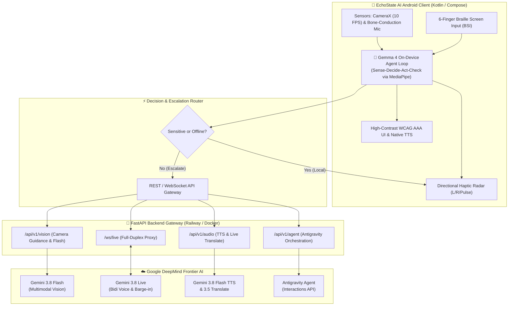

# EchoState AI

<div align="center">

[](https://opensource.org/licenses/Apache-2.0)
[](https://github.com/Cherie05/vespers-echostate-ai/actions/workflows/backend-ci.yml)
[](https://github.com/Cherie05/vespers-echostate-ai/actions/workflows/android-ci.yml)
[](https://kotlinlang.org)
[](https://fastapi.tiangolo.com)
[](https://www.python.org)
[](https://www.w3.org/WAI/standards-guidelines/wcag/)
[](https://railway.app)

**An Autonomous, Multi-Modal Accessibility Platform Empowering Blind, Visually Impaired, and Deaf-Blind Independence.**

*Built for the Google DeepMind Hackathon 2026.*

[Problem Statement Alignment](#-google-deepmind-hackathon-track-alignment) •
[Architecture](#-system-architecture) •
[Key Features](#-key-features) •
[Quickstart](#-quickstart-guide) •
[API Reference](#-api--websocket-reference) •
[Contributing](#-contributing)

</div>

---

## 🌟 Vision & Overview

Traditional assistive tools often treat vision, voice, and touch in isolation. They introduce frustrating latency, expose private documents (prescriptions, ID cards) to remote cloud servers, and fail when wireless connectivity drops.

**EchoState AI** unifies **on-device edge intelligence** with **frontier cloud models** into a single cohesive platform:
- **Local-First Autonomy**: High-frequency Sense-Decide-Act loops run **100% on-device** via **Gemma 4** (2B/4B), guaranteeing instant tactile response and total data privacy.
- **Frontier Cloud Escalation**: When complex visual reasoning, foreign language translation, or voice-to-voice conversation is required, tasks escalate seamlessly to **Gemini 3.8 Live**, **Gemini 3.8 Flash**, and the **Antigravity Managed Agent**.
- **Universal Multi-Sensory UX**: Combines 6-finger Braille Screen Input (BSI), directional haptic vibration radar, high-contrast WCAG AAA UI, and instant mid-sentence voice barge-in.

---

## 🏆 Google DeepMind Hackathon Track Alignment

| Track | Model / Component | Role in EchoState AI |
| :--- | :--- | :--- |
| **Track 5: Local-First Agents** | **Gemma 4 (E2B / E4B)** via MediaPipe GenAI SDK | **On-Device Edge Loop**: Runs locally at 0ms network latency. Parses Braille commands, inspects sensitive documents (prescriptions, cards) offline, and autonomously decides whether to act locally or escalate to cloud. |
| **Track 2: Next-Gen Voice** | **Gemini 3.8 Live** (`gemini-3.8-live`) | **Full-Duplex Voice-to-Voice**: WebSocket stream (`/ws/live`) with sub-150ms barge-in support. Users can interrupt the assistant naturally mid-speech. |
| **Track 2: Speech & Translation** | **Gemini 3.8 Flash TTS** & **Gemini 3.5 Live Translate** | **Spoken Accessibility**: Synthesizes natural, human-grade vocal guidance and translates ambient conversations while preserving acoustic tone and emotional cadence. |
| **Track 1: Frontier Multimodal** | **Gemini 3.8 Flash** (`gemini-3.8-flash`) | **Real-Time Spatial Vision**: Rapidly parses 10 FPS camera feeds for obstacle warnings, sign reading, and spatial camera alignment hints. |
| **Track 4: Autonomous Agents** | **Antigravity Agent (`antigravity-preview-09-2026`)** | **Autonomous Journey Orchestrator**: Executes stateful, multi-step navigation plans, error recovery, and complex errands via the Google Interactions API. |

---

## 🏛️ System Architecture



---

## ✨ Key Features

### 1. 🧠 On-Device Autonomous Loop (Gemma 4)
- Implements an iterative **Sense-Decide-Act-Check** loop running locally on device.
- Reads private items like prescription labels, bank cards, and personal notes without transmitting a single byte to external servers.
- Manages device sensors and triggers cloud escalation only when contextual reasoning demands it.

### 2. 🎙️ Full-Duplex Voice-to-Voice (Gemini 3.8 Live)
- Bidirectional WebSocket streaming (`/ws/live`) with continuous audio in and out.
- **Mid-sentence barge-in**: Interrupt the assistant at any moment—audio generation stops in under 150ms and pivots to your new question.
- Native Android Text-To-Speech fallback for reliable accessibility even in low-bandwidth environments.

### 3. 👁️ Spatial Camera Guidance & Haptic Radar (Gemini 3.8 Flash)
- Directs users toward targets (documents, doors, signs) using intelligent directional haptic cues:
  - **Left Vibration**: Tilt/pan phone to the left.
  - **Right Vibration**: Tilt/pan phone to the right.
  - **Double Pulse**: Target is centered, stabilized, and ready for capture.

### 4. ⌨️ 6-Finger Braille Screen Input (BSI)
- Full-screen multi-touch surface supporting 6-dot Perkins-style Braille entry.
- Deaf-blind individuals can compose messages, control the application, and trigger agent workflows silently and tactilely.

### 5. 🤝 Two-Way Deaf-Blind Communication Card
- Converts incoming conversational speech into clear, high-contrast, oversized text cards.
- Provides immediate tactile haptic feedback confirming that spoken words were acknowledged.

### 6. 🤖 Autonomous Task Planning (Antigravity Agent)
- Connects to `antigravity-preview-09-2026` through Google's Interactions API.
- Handles long-horizon tasks such as step-by-step indoor navigation, transit assistance, and contingency recovery.

---

## 📂 Repository Structure

```
gdg-deepmind/
├── .github/
│   ├── workflows/
│   │   ├── backend-ci.yml             # Automated FastAPI test & syntax workflow
│   │   └── android-ci.yml             # Android Gradle build & validation workflow
│   ├── ISSUE_TEMPLATE/
│   │   ├── bug_report.md              # Structured bug report template
│   │   ├── feature_request.md         # Feature request template with accessibility focus
│   │   └── config.yml                 # GitHub community issue links
│   └── PULL_REQUEST_TEMPLATE.md       # PR checklist and verification template
│
├── backend/                           # Python FastAPI Gateway
│   ├── Dockerfile                     # Optimized container build for Railway
│   ├── railway.json                   # Railway deployment configuration
│   ├── requirements.txt               # FastAPI, WebSockets, Google Gen AI SDK
│   ├── .env.example                   # Environment configuration template
│   ├── app/
│   │   ├── main.py                    # Gateway entrypoint, CORS, routers & healthcheck
│   │   ├── config.py                  # Pydantic configuration & model definitions
│   │   ├── routers/
│   │   │   ├── vision.py              # Gemini 3.8 Flash (Camera guidance & scene analysis)
│   │   │   ├── audio.py               # Gemini 3.8 Flash TTS, Transcribe & Live Translate
│   │   │   ├── live.py                # Gemini 3.8 Live bidirectional WebSocket proxy
│   │   │   └── agent.py               # Antigravity Agent Interactions API orchestrator
│   │   └── services/
│   │       ├── gemini_service.py      # Google Gen AI SDK wrapper
│   │       └── antigravity_service.py # Managed agent coordination service
│   └── tests/
│       ├── __init__.py
│       └── test_api.py                # API and healthcheck unit tests
│
├── app/                               # Native Android App (Kotlin & Jetpack Compose)
│   ├── app/src/main/
│   │   ├── java/com/echostate/ai/
│   │   │   ├── MainActivity.kt        # Main entrypoint & runtime permission orchestrator
│   │   │   ├── accessibility/         # 6-finger Braille Screen Input & Haptic engine
│   │   │   ├── audio/                 # WebSocket streaming audio engine
│   │   │   ├── camera/                # CameraX frame analyzer & live buffer
│   │   │   ├── cloud/                 # HTTP/WebSocket gateway integration client
│   │   │   ├── llm/                   # Gemma 4 offline Sense-Decide-Act-Check loop
│   │   │   ├── ui/                    # WCAG AAA High-Contrast Compose screens
│   │   │   └── viewmodel/             # EchoState state management & speech synthesizer
│   │   ├── AndroidManifest.xml
│   │   └── build.gradle.kts           # Configured with BuildConfig backend URLs
│   ├── build.gradle.kts
│   ├── gradle.properties              # Includes Android 15 (16KB page size) legacy packaging
│   └── local.properties.example       # Development template for backend URLs & keys
│
├── .gitignore                         # Zero-leakage git ignore for backend & mobile
├── CONTRIBUTING.md                    # Contributor guide and standards
├── CODE_OF_CONDUCT.md                 # Contributor Covenant Code of Conduct
├── LICENSE                            # Apache License 2.0
├── SECURITY.md                        # Security policy and secret safety guidelines
└── README.md                          # Project documentation
```

---

## 🚀 Quickstart Guide

### Option 1: Deploy the Backend to Railway

Deploy the backend to [Railway](https://railway.app) in 3 simple steps:

1. Fork or push this repository to GitHub.
2. In Railway, click **New Project** ➔ **Deploy from GitHub repo** ➔ Select your repository.
3. In service **Settings**, set **Root Directory** to `/backend`.
4. In the **Variables** tab, supply:
   - `GEMINI_API_KEY`: Your Google Gen AI API key.
   - `ANTIGRAVITY_API_KEY`: *(Optional)* Your Antigravity key.
5. Railway will automatically build the `backend/Dockerfile` and provide a public HTTPS/WSS domain (e.g. `https://your-service.up.railway.app`).

---

### Option 2: Run the Backend Locally

```bash
# 1. Navigate to backend directory
cd backend

# 2. Create and activate a Python virtual environment
python -m venv venv
# On Windows:
.\venv\Scripts\activate
# On macOS / Linux:
source venv/bin/activate

# 3. Install dependencies
pip install -r requirements.txt

# 4. Configure environment
cp .env.example .env
# Edit .env with your GEMINI_API_KEY

# 5. Launch development server
uvicorn app.main:app --reload --host 0.0.0.0 --port 8000
```

- **Interactive API Documentation (Swagger)**: [http://localhost:8000/docs](http://localhost:8000/docs)
- **Healthcheck Endpoint**: [http://localhost:8000/health](http://localhost:8000/health)

---

### Option 3: Run the Android App

1. Open the `/app` folder in **Android Studio** (Koala / Ladybug or newer recommended).
2. Copy `local.properties.example` to `local.properties`:
   ```properties
   # For local emulator:
   BACKEND_BASE_URL=http://10.0.2.2:8000
   BACKEND_WS_URL=ws://10.0.2.2:8000

   # Or for physical devices using your Railway deployment:
   # BACKEND_BASE_URL=https://your-service.up.railway.app
   # BACKEND_WS_URL=wss://your-service.up.railway.app
   ```
3. Connect your Android phone (or launch an emulator) and click **Run**.
4. The app supports **Android 14+** and is fully compatible with **Android 15 (16KB memory page sizes)**.

---

## 📡 API & WebSocket Reference

### Multimodal Vision (`/api/v1/vision`)
- `POST /api/v1/vision/analyze`: Accepts multipart image/video files for scene comprehension.
- `POST /api/v1/vision/analyze-base64`: Direct streaming inference on base64-encoded CameraX frames.
- `POST /api/v1/vision/camera-guidance`: Evaluates subject alignment and returns spatial hints (`tilt_left`, `tilt_right`, `move_higher`, `centered`) with designated haptic patterns.
- `POST /api/v1/vision/chat`: Conversational multimodal queries with Gemini 3.8 Flash.

### Voice & Audio (`/api/v1/audio`)
- `POST /api/v1/audio/tts`: Generates spoken audio via Gemini 3.8 Flash TTS.
- `POST /api/v1/audio/tts/stream`: Returns direct MP3 byte stream for immediate mobile playback.
- `POST /api/v1/audio/transcribe`: High-accuracy transcription of bone-conduction microphone input.
- `POST /api/v1/audio/translate`: Cross-language speech translation preserving emotional pitch.

### Live Voice-to-Voice (`/ws/live`)
- Full-duplex bidirectional WebSocket connection bridging mobile audio buffers directly to **Gemini 3.8 Live**.
- Sends raw audio chunks and handles instant barge-in cancellations.

### Agent Orchestration (`/api/v1/agent`)
- `POST /api/v1/agent/orchestrate`: Multi-agent step planning and state recovery via **Antigravity Agent** (`antigravity-preview-09-2026`).

---

## ♿ Accessibility & Design Principles

EchoState AI adheres strictly to the highest accessibility standards:
- **WCAG 2.2 Level AAA Compliance**: High contrast ratios (exceeding 7:1) using deep obsidian black (`#0A0A0C`), tactile gold accents (`#F59E0B`), and vibrant assistive cyan (`#06B6D4`).
- **Tactile Feedback**: Distinct haptic waveforms for orientation confirmation, danger warnings, and Braille input registration.
- **Screen Reader Compatibility**: Fully labeled semantic tree and custom action descriptors for TalkBack.
- **Privacy by Architecture**: Offline evaluation of private credentials ensures that personal data never leaves the handset.

---

## 🧪 Testing & CI/CD

Both the backend and Android client are backed by continuous integration pipelines:

```bash
# Run backend unit tests
cd backend
python -m unittest discover -s tests -p "test_*.py"

# Build and validate Android client
cd app
./gradlew assembleDebug
```

---

## 🤝 Contributing

Contributions from engineers, accessibility specialists, and the open-source community are warmly welcomed! Please read our [Contributing Guide](CONTRIBUTING.md) and [Code of Conduct](CODE_OF_CONDUCT.md) before submitting pull requests.

---

## 🔒 Security & Privacy

For vulnerability reporting and details on our privacy sandbox, please consult our [Security Policy](SECURITY.md).

---

## 📄 License

EchoState AI is open-source software licensed under the **[Apache License, Version 2.0](LICENSE)**.

---

<div align="center">
Made with ❤️ for the <b>Google DeepMind Hackathon 2026</b>
</div>
