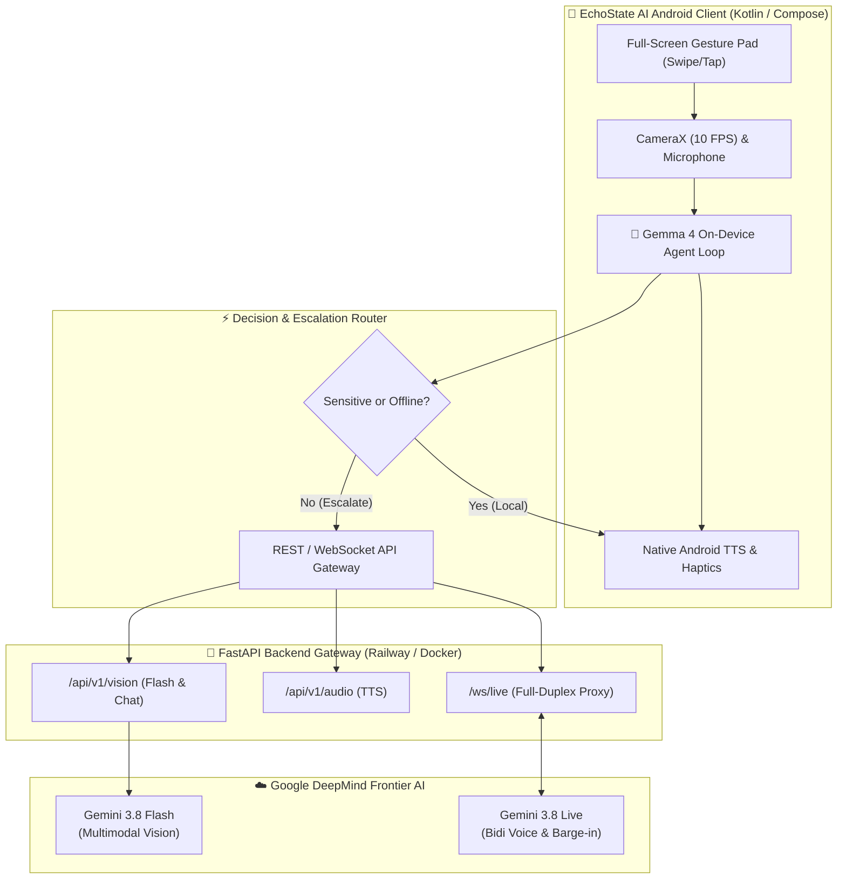

# EchoState AI

<div align="center">

[](https://opensource.org/licenses/Apache-2.0)
[](https://github.com/Cherie05/vespers-echostate-ai/actions/workflows/backend-ci.yml)
[](https://github.com/Cherie05/vespers-echostate-ai/actions/workflows/android-ci.yml)
[](https://kotlinlang.org)
[](https://fastapi.tiangolo.com)
[](https://www.python.org)
[](https://www.w3.org/WAI/standards-guidelines/wcag/)
[](https://railway.app)

**An Autonomous, Multi-Modal Accessibility Platform Empowering Blind, Visually Impaired, and Deaf-Blind Independence.**

*Built for the Google DeepMind Hackathon 2026.*

[Problem Statement Alignment](#-google-deepmind-hackathon-track-alignment) •
[Architecture](#-system-architecture) •
[Key Features](#-key-features) •
[Quickstart](#-quickstart-guide) •
[API Reference](#-api--websocket-reference) •
[Contributing](#-contributing)

</div>

---

## 🔗 Live Demo Links
- **Android APK Download:** [Download EchoState AI Alpha (v1.0)](https://github.com/Cherie05/vespers-echostate-ai/releases/latest)
- **Production Backend API Docs:** [https://vespers-echostate-ai-production.up.railway.app/docs](https://vespers-echostate-ai-production.up.railway.app/docs)
- **Production WebSocket Endpoint:** `wss://vespers-echostate-ai-production.up.railway.app/ws/live`

---

## 🌟 Vision & Overview

Traditional assistive tools force visually impaired users to interact with interfaces designed for sighted people—requiring them to hunt for tiny on-screen buttons, deal with frustrating latency, and expose private documents to remote cloud servers.

**EchoState AI** completely reimagines accessibility by unifying a **100% eyes-free, buttonless gesture interface**, **on-device edge intelligence**, and **frontier cloud models** into a single cohesive platform:
- **Zero-Button, Eyes-Free UI**: The entire app is driven by full-screen swipes and taps. No hunting for buttons. Auto-announcing audio guides the user at every step.
- **Local-First Autonomy**: High-frequency Sense-Decide-Act loops run **100% on-device** via **Gemma 4** (2B/4B), guaranteeing instant tactile response and total data privacy for sensitive items (prescriptions, ID cards).
- **Frontier Cloud Escalation**: When complex visual reasoning or conversational voice AI is required, tasks escalate seamlessly to **Gemini 3.8 Live**, **Gemini 3.8 Flash**, and the **Antigravity Managed Agent**.

---

## 🏆 Google DeepMind Hackathon Track Alignment

| Track | Model / Component | Role in EchoState AI |
| :--- | :--- | :--- |
| **Track 1: Frontier Multimodal** | **Gemini 3.8 Flash** (`gemini-3.8-flash`) | **Real-Time Spatial Vision & Interrogation**: Users can tap to instantly describe obstacles, or *long-press* to ask specific questions about the camera scene (e.g., "What does this sign say?"). |
| **Track 2: Next-Gen Voice** | **Gemini 3.8 Live** (`gemini-3.8-live`) | **Full-Duplex Voice-to-Voice**: WebSocket stream (`/ws/live`) with sub-150ms barge-in support. Users can interrupt the assistant naturally mid-speech using full-screen tap gestures. |
| **Track 4: Autonomous Agents** | **Antigravity Agent (`antigravity-preview-09-2026`)** | **Autonomous Journey Orchestrator**: Executes stateful, multi-step navigation plans, error recovery, and complex errands via the Google Interactions API. |
| **Track 5: Local-First Agents** | **Gemma 4 (E2B / E4B)** via MediaPipe | **On-Device Edge Loop**: Runs locally at 0ms latency. Parses Braille commands, inspects sensitive documents offline, and autonomously decides whether to act locally or escalate to cloud. |

---

## ✨ Key Features

### 1. 🖐️ 100% Eyes-Free Gesture Navigation (New!)
- **No Buttons:** The entire screen is a gesture pad. 
- **Intuitive Swipes:** Swipe UP for Camera Mode, Swipe DOWN for Voice Mode. Swipe DOWN again to exit any mode.
- **Contextual Taps:** Tap anywhere to trigger an action (capture scene, start listening). Double-tap to repeat audio instructions.
- **Always Speaking:** Native Android Text-To-Speech (TTS) automatically announces the current state and instructions, ensuring the user is never lost.

### 2. 👁️ Interactive Spatial Camera (Gemini 3.8 Flash)
- **Short Tap:** Instantly captures a 10 FPS camera frame and describes immediate obstacles or pathways.
- **Long Press (Scene Interrogation):** Triggers the microphone. The user can ask a specific question (e.g., *"Is there an empty chair?"*), and Gemini 3.8 Flash will analyze the live camera feed to answer that exact question aloud.

### 3. 🎙️ Full-Duplex Voice-to-Voice (Gemini 3.8 Live)
- Bidirectional WebSocket streaming (`/ws/live`) with continuous audio in and out.
- Tap the screen to start speaking, tap again to stop.
- Supports **mid-sentence barge-in**: Interrupt the assistant at any moment—audio generation stops in under 150ms and pivots to your new question.

### 4. 🧠 On-Device Autonomous Loop (Gemma 4)
- Implements an iterative **Sense-Decide-Act-Check** loop running locally on device via MediaPipe.
- Reads private items like prescription labels, bank cards, and personal notes without transmitting a single byte to external servers.

### 5. ⌨️ 6-Finger Braille Screen Input (BSI) & Deaf-Blind UI
- Full-screen multi-touch surface supporting 6-dot Perkins-style Braille entry.
- **Two-Way Deaf-Blind Communication Card**: Converts incoming conversational speech into clear, high-contrast, oversized text cards with distinct haptic vibration pulses.

---

## 🏛️ System Architecture



---

## 🚀 Quickstart Guide

### Option 1: Deploy the Backend to Railway (Production)

Deploy the backend to [Railway](https://railway.app) in 3 simple steps:
1. Fork or push this repository to GitHub.
2. In Railway, click **New Project** ➔ **Deploy from GitHub repo** ➔ Select your repository.
3. In service **Settings**, set **Root Directory** to `/backend`.
4. In the **Variables** tab, supply:
   - `GEMINI_API_KEY`: Your Google Gen AI API key.
5. Railway will automatically build the `backend/Dockerfile` and provide a public HTTPS/WSS domain.

### Option 2: Run the Backend Locally (Development)

```bash
# 1. Navigate to backend directory
cd backend

# 2. Create and activate a Python virtual environment
python -m venv venv
source venv/bin/activate  # (On Windows use: .\venv\Scripts\activate)

# 3. Install dependencies
pip install -r requirements.txt

# 4. Configure environment
cp .env.example .env
# Edit .env with your GEMINI_API_KEY

# 5. Launch development server
uvicorn app.main:app --reload --host 0.0.0.0 --port 8000
```
- **Interactive API Docs**: [http://localhost:8000/docs](http://localhost:8000/docs)

### Option 3: Run the Android App

1. Open the `/app` folder in **Android Studio**.
2. Create a file named `local.properties` in the `/app` directory and add your backend URLs:
   ```properties
   # Replace with your deployed Railway URLs, ensuring https:// and wss:// are included:
   BACKEND_BASE_URL=https://your-service.up.railway.app
   BACKEND_WS_URL=wss://your-service.up.railway.app
   ```
3. Connect your Android phone (Android 14+ recommended) and click **Run**.
4. **Note:** The app is configured with `useLegacyPackaging = true` to fully support Android 15 devices with 16KB memory page sizes (like the POCO F6).

---

## 📡 API & WebSocket Reference

- `POST /api/v1/vision/analyze-base64`: Direct streaming inference on base64-encoded CameraX frames for rapid scene analysis. Includes optional `prompt` injection for interrogating specific scenes.
- `POST /api/v1/vision/chat`: Conversational multimodal queries with Gemini 3.8 Flash.
- `POST /api/v1/audio/tts`: Generates spoken audio via Gemini 3.8 Flash TTS.
- `WS /ws/live`: Full-duplex bidirectional WebSocket connection bridging mobile audio buffers directly to **Gemini 3.8 Live**.

---

## ♿ Accessibility & Design Principles

EchoState AI adheres strictly to the highest accessibility standards:
- **No-Look Navigation:** Utlizes absolute touch coordinates and swipe directions instead of rigid bounding boxes.
- **WCAG 2.2 Level AAA Compliance**: High contrast ratios using deep obsidian black (`#0A0A0C`) and tactile gold/cyan text for low-vision users.
- **Tactile Feedback**: Distinct haptic waveforms for orientation confirmation and mode switching.
- **Privacy by Architecture**: Offline evaluation of private credentials ensures that personal data never leaves the handset.

---

## 📄 License

EchoState AI is open-source software licensed under the **[Apache License, Version 2.0](LICENSE)**.

<div align="center">
Made with ❤️ for the <b>Google DeepMind Hackathon 2026</b>
</div>
